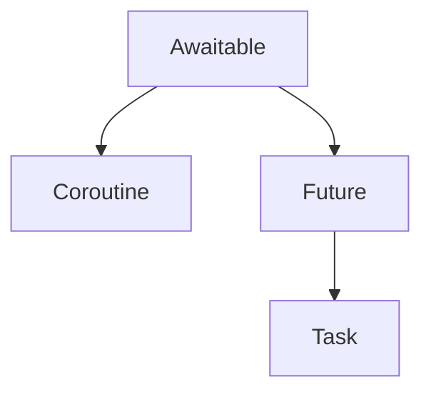

<!--more -->

<br/>

&nbsp;&nbsp; 이번 포스트에서는 세 번째 주제 **코루틴(Coroutines)**를 다루겠습니다.

1. 병렬 처리의 의미 및 멀티 스레딩과 Async의 차이
2. 이벤트 루프
3. **코루틴(Coroutines)**
4. 코루틴의 작동 방식

&nbsp;&nbsp; 위 주제들은 다음의 유튜브 영상을 **참조 및 일부 요약 • 발췌**한 것으로, 파이썬 Asnyc가 처음이거나, 이해가 잘 안 될 때는 해당 영상을 참조하시기를 바랍니다.

[Import asyncio by EdgeDB](https://www.youtube.com/watch?v=E7Yn5biBZ58&list=PLhNSoGM2ik6SIkVGXWBwerucXjgP1rHmB&index=3)

---

### (0) Awaitable 객체, 그리고 ...



&nbsp;&nbsp; 이번 포스트의 주제는 코루틴입니다. 코루틴을 이해하기에 앞서, 연관 개념들을 살펴봐야 합니다. 다룰 개념은 Awaitable과 Coroutine, Future과 Task, 총 네 가지입니다. 이 네 개념들의 공통점은 모두 **객체**라는 점입니다. 먼저, Awaitable과 Coroutine에 대해 알아보겠습니다.

<br/>

### (1) Awaitable과 Coroutine

#### Awaitable

&nbsp;&nbsp; "Awaitable"의 명칭과 정의는 한글로 표현하기가 까다롭습니다. 그래서 그냥 영어로 나타내면 다음과 같습니다.

> Awaitable : Any object that can be awaited on.

&nbsp;&nbsp; "can be awaited on"한 모든 객체가 "Awaitable"입니다. 여기서 "can be awaited on"이란 "(작업 종료 시점이) suspended 될 수 있는", 즉 "유예될 수 있는", "뒤로 미뤄질 수 있는"의 의미로 이해하면 될 것 같습니다.

&nbsp;&nbsp; 비동기 처리의 핵심은 지연 시간(Latency)이 있는 롱 러닝(long-running) 태스크를 백그라운드로 전달하여 완료되기를 기다리는 것이라고 앞의 포스트들에서 반복해서 이야기했습니다. 이때 태스크가 백그라운드로 전달되어 완료되기를 기다리는 것이 "be awaited on"입니다.

&nbsp;&nbsp; 코드 표현에서 "can be awaited on"이란 async-await 구문에서 await 뒤에 놓일 수 있는 코드 수식(또는 함수)을 의미합니다. 이 await 표현이 인스턴스화 된 것이 바로 "awaitable"입니다. 예시를 들면 다음과 같습니다.

```python
async def keep_printing(name: str="") -> None:
  while True:
    print(name)
    awaitable_obj = await asyncio.sleep(1)
    # asnycio.sleep(1)은 "can be awaited on"한 코드 수식, 즉, await 뒤에 놓일 수 있는 코드 수식

    # awaitable은 await 표현이 인스턴스화 된 것

# 실행 결과
# 1초 간격으로 name을 출력
```

&nbsp;&nbsp; 변수를 할당하는 것처럼 await 표현을 사용했을 때, 생성된 인스턴스가 바로 "Awaitable" 객체입니다. 그래서 정의를 다시하면 다음과 같습니다.

> Awaitable is the object that can be used in an await expression. [Python Docs](https://docs.python.org/3/library/asyncio-task.html#coroutines)

&nbsp;&nbsp; 그렇다면 <code>awaitable_obj</code>과 <code>asyncio.sleep(1)</code> 각각의 타입을 확인하면 어떤 결과가 나올까요?

```python
print(type(asyncio.sleep()))
print(type(awaitable_obj))

# 실행 결과
# << class 'function' >>
# << class 'coroutine' >>
```

&nbsp;&nbsp; 출력 결과, <code>awaitable_obj</code>의 타입은 <code>awaitable</code> 클래스가 아닌 <code>coroutine</code> 클래스임을 확인할 수 있습니다.

&nbsp;&nbsp; 사실 파이썬 내 awaitable이라는 클래스는 존재하지 않습니다. awaitable은 추상과 같습니다. awaitable은 하나의 개념이지, 실체가 아닙니다. 이 개념이 실제 코드로 실체화되면, (인스턴스가 되면) coroutine, future 그리고 task라는 구체성을 갖게 됩니다. 그렇다면 coroutine은 무엇일까요?

#### Coroutine

&nbsp;&nbsp; Async 함수가 호출되면 coroutine이 생성됩니다. 함수가 호출되면 어딘가의 메모리에 자리를 차지하게 되고, 이로써 인스턴스가 됩니다. 이렇게 생성된 인스턴스가 바로 coroutine입니다. 다시, corutine이란 async 함수를 호출함으로써 생성된 인스턴스입니다. 그리고 async 함수 안에는 항상 await 표현이 있기 때문에, 그 await 표현은 개념적으로 awaitable한 객체가 됩니다.

&nbsp;&nbsp; 이제 아래 코드의 출력 결과를 예상해봅시다.

```python
import asyncio
import datetime


async def keep_printing(name: str = "") -> None:
    while True:
        print(name, datetime.datetime.now())
        await asyncio.sleep(2)
        print("called", name)


async def async_main() -> None:
    try:
        await keep_printing("First"),
        await keep_printing("Second"),
        await keep_printing("Third"),
    except asyncio.TimeoutError:
        print("시간 종료")


asyncio.run(async_main())

# 실행 결과
# First 2023-04-28 14:11:40.748181
# called First
# First 2023-04-28 14:11:42.750504
# called First
# First 2023-04-28 14:11:44.752931
# called First
# First 2023-04-28 14:11:46.755621
# called First
# First 2023-04-28 14:11:48.757963
# called First
# ...
```

&nbsp;&nbsp; 함수 실행 결과, 대략 2초 간격으로 "First"만 출력됨을 알 수 있습니다.

&nbsp;&nbsp; <code>keep_printing</code> 함수 안의 조건문이 항상 <code>True</code>이기 때문에, 컴파일러가 제동을 걸지 않는 이상 "First"는 무한대로 출력될 것임을 예상할 수 있습니다. 그런데 asnyc- await는 비동기 처리를 위해서 사용하고, 비동기 처리는 병렬 처리가 핵심인데, "Second"와 "Third"는 실행되지 않는 것이 이상하게 생각될 수 있습니다. 어떻게 해야 "Second"와 "Third"도 함께 출력할 수 있을까요?

&nbsp;&nbsp; Coroutine이 생성됐다고 해서, 그것이 각각 awaitable한 객체를 언제 실행할 것인가를 스스로 정하지는 않습니다. 위의 <code>keep_printing("First")</code>은 다만 실행 순서에 맞춰서 먼저 실행됐을 뿐이고, <code>keep_printing("Second")</code>와 <code>keep_printing("Third")</code>는 언제 실행될 것인지 스케쥴링되지 않았기에 평범하게 동기적으로 처리되는 것입니다.

&nbsp;&nbsp; Asnycio의 강점은 바로 이 생성된 Coroutine들이 언제 실행될 것인지를 **스케쥴링**할 수 있다는 것입니다. 만약 "First", "Second", "Third"가 한 번에 출력되게끔 스케쥴링 하고 싶다면, <code>asyncio.gather</code> 메소드를 사용하면 됩니다. 세 개의 awaitable을 <code>asyncio.gather</code>의 인자로 삼아 다시 코드를 구현하겠습니다.

```python

#... same codes

async def async_main() -> None:
    try:
        await asyncio.gather(
            keep_printing("First"),
            keep_printing("Second"),
            keep_printing("Third"),
        )
    except asyncio.TimeoutError:
        print("시간 종료")

asyncio.run(async_main())

# 실행 결과
# First 2023-04-28 14:08:47.009419
# Second 2023-04-28 14:08:47.009471
# Third 2023-04-28 14:08:47.009482
# called First
# First 2023-04-28 14:08:49.011887
# called Second
# Second 2023-04-28 14:08:49.011932
# called Third
# Third 2023-04-28 14:08:49.011943
# called First
# First 2023-04-28 14:08:51.014252
# called Second
# Second 2023-04-28 14:08:51.014343
# called Thrid
# Third 2023-04-28 14:08:51.014388
# called First
# ...
```

&nbsp;&nbsp; 이제 원하는 대로 동시에 실행되는 것을 확인할 수 있습니다. <code>asyncio.gather</code>로 세 awaitable이 함께 실행되게끔 스케쥴링한 것입니다.

&nbsp;&nbsp; 주목할 점은 각각이 출력된 시점입니다. 초 단위로 보면 같지만, 소수점 다여섯 번째 자리를 확인하면 실행 시간이 다름을 확인할 수 있습니다. 앞의 포스트들에서 이미 몇 차례 언급한 바, 비동기 처리의 핵심은 지연 시간이 있는 태스크를 백그라운드로 넘기고, 그것의 완료 여부를 계속해서 주시하는 것이 핵심입니다. 그리고 태스크가 완료되면 스케쥴링된 대로 결과를 반환합니다.

&nbsp;&nbsp; 처음 <code>keep_printing("First)</code>가 태스크로서 실행되고, 이내 그 안의 <code>await asyncio.sleep(2)</code>가 실행되면 현재 태스크는 중단되고, 정해진 시간 동안 다른 태스크들이 실행됩니다. 현재 태스크가 중단되고, 다른 태스크들이 실행되는 그 과정에서 아주 작은 시간차가 발생하는 것입니다. 다만, 사람이 지각할 수 있는 수준이 아니기 때문에 동시 발생(Concurrency)로 보이는 것입니다!

> async.sleep(delay, result=None) : Block for delay seconds. asnyc.sleep() always suspends the current task, allowing other tasks to run. [Python Docs](https://docs.python.org/3/library/asyncio-task.html#coroutines)

&nbsp;&nbsp; 만약 동기 처리였다면, "Second"와 "Third"는 절대 출력될 일이 없습니다.

&nbsp;&nbsp; 한 가지 더 주목할 점은 "Called"의 출력 시점입니다. 바로 위 코드의 출력 결과를 한 번 더 보겠습니다.

```python
# 실행 결과
# First 2023-04-28 14:08:47.009419
# Second 2023-04-28 14:08:47.009471
# Third 2023-04-28 14:08:47.009482
# called First
# First 2023-04-28 14:08:49.011887
# called Second
# Second 2023-04-28 14:08:49.011932
# called Third
# Third 2023-04-28 14:08:49.011943
# called First
# First 2023-04-28 14:08:51.014252
# called Second
# Second 2023-04-28 14:08:51.014343
# called Thrid
# Third 2023-04-28 14:08:51.014388
# called First
# ...
```

&nbsp;&nbsp;

**출처**

[Import asyncio by EdgeDB](https://www.youtube.com/watch?v=E7Yn5biBZ58&list=PLhNSoGM2ik6SIkVGXWBwerucXjgP1rHmB&index=3)
[Python Docs](https://docs.python.org/3/library/asyncio-task.html#coroutines)
