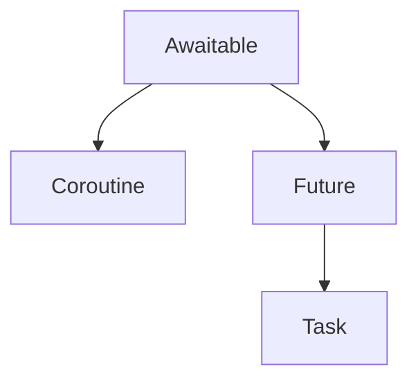

<!--more -->

 

&nbsp;&nbsp; 이번 포스트에서는 세 번째 주제 "코루틴"를 다루겠습니다.

1. 병렬 처리의 의미 및 멀티 스레딩과 Async의 차이
2. 이벤트 루프
3. **코루틴(Coroutines)**
4. 코루틴의 작동 방식
5. Batteries Included
6. An Example Web Application With Starlette and EdgeDB

&nbsp;&nbsp; 위 6개 주제는 다음의 유튜브 영상을 **참조 요약**한 것으로, 파이썬 Asnyc가 처음이거나, 이해가 잘 안 될 때는 해당 영상을 참조하시기를 바랍니다.

[Import asyncio by EdgeDB](https://www.youtube.com/watch?v=E7Yn5biBZ58&list=PLhNSoGM2ik6SIkVGXWBwerucXjgP1rHmB&index=3)

---

### (1) Async 함수와 코루틴(Coroutines)

&nbsp;&nbsp; 이번 포스트의 주제는 코루틴입니다. 코루틴을 이해하기에 앞서, 연관 개념들을 살펴봐야 합니다. 다룰 개념은 총 4가지입니다. Awaitable, Future, Task, 그리고 Coroutine입니다. 이 네 개념들의 공통점은 모두 **객체**라는 점입니다.

Awaitable :
Coroutine :
Future :
Task :

### (2) await란?

### (3) 백그라운드에 작업시키기

### (4) 백그라운드 작업 기다리기

&nbsp;&nbsp;
&nbsp;&nbsp;
&nbsp;&nbsp;
&nbsp;&nbsp;
&nbsp;&nbsp;
&nbsp;&nbsp;
&nbsp;&nbsp;
&nbsp;&nbsp;
&nbsp;&nbsp;
&nbsp;&nbsp;

**출처**

[Import asyncio by EdgeDB](https://www.youtube.com/watch?v=E7Yn5biBZ58&list=PLhNSoGM2ik6SIkVGXWBwerucXjgP1rHmB&index=3)
