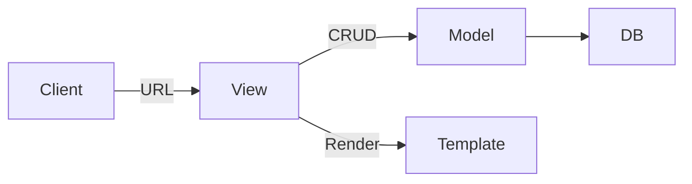

<!--more-->

<br/>

&nbsp;&nbsp; 스파르타 코딩 클럽의 Django 실무 기초 강의를 다 들었습니다. 사용해보고 나서 느낀 점은 **정말 사용하기 편하다**라는 것입니다. SQL문을 작성하지 않고 파이썬 코드로 DB와 연동할 수 있다는 점, 내장된 관리자 패널을 제공한다는 점, 보안에 덜 신경 써도 된다는 점 등이 우선 확실하게 체감이 되는 것 같습니다. 예를 들면, Django의 인증 시스템 덕분에 User 모델을 통해 User 인스턴스를 생성하면 비밀번호가 자동으로 해쉬되어 저장되는 등, Express였다면 일일이 신경썼어야 할 부분들이 Django에서는 기본으로 제공됩니다. 아직 빙산의 일각밖에 엿보지 않았지만, 손에 익숙해지면 금방 금방 익힐 수 있을 것 같습니다.

&nbsp;&nbsp; 그전에 이 Django를 더 잘 사용하기 위해서는 아무래도 ORM과 MVT 개념에 대해 잘 이해를 해야 할 것 같습니다.

1. ORM(Object Relational Model) : 관계형 DB와 객체 지향 언어의 모델 사이에서 데이터를 변환하는 프로그래밍 기술, 객체 지향 언어의 객체 지향과 관계형 DB의 각 특성들을 합친 것

2. MVT(Model, View, Template) : 생성된 모델(Model)과 템플릿(Template) 간의 상호작용을 view라는 콘트롤러로 관리하는 소프트웨어 디자인 패턴

<br/>

### (1) ORM

&nbsp;&nbsp; ORM의 정의 자체는 문득 보기에 이해하기 까다로울 수 있습니다만, 직접 사용하고 난 후기로는 "파이썬 코드로 클래스를 정의하고, 인스턴스를 생성하면 Django가 알아서 DB에 저장해준다"는 것입니다. 가령, User 데이터를 DB에 저장한다고 가정하면, 다음과 같이 데이터들이 쌓일 것입니다.

| id  | username | password                    | email            | address              |
| --- | -------- | --------------------------- | ---------------- | -------------------- |
| 1   | 갑돌이   | 112fsdowaE$@#$RFsdjfwaie392 | temp1@naver.com  | somewhere in seoul   |
| 2   | 갑순이   | zcxvdsft4%RW23$ve132#!2334  | temp2@google.com | somewhere in daejeon |
| 3   | 점순이   | @#23sdcvsd$432430(9848%$2d  | temp3@damu.net   | somewhere in busan   |

<br/>

&nbsp;&nbsp; 이렇게 데이터들이 차곡차곡 쌓이면, "이 데이터들을 서버로 가지고 오려면 어떻게 해야 할까?"를 고민해야 합니다. 로그인을 할 때 유효한 계정인지, 계정 등록을 할 때 username이나 email이 중복되지는 않는지 등을 확인하려면 말입니다. 즉, 서버와 DB를 어떻게 연동해야 할 것인지를 고민해야 합니다. Django에서는 그런 걱정을 덜 수 있습니다.

&nbsp;&nbsp; Django에서는 파이썬에서 클래스를 생성하고, 내부 변수를 선언하고, 메소드를 정의하는 것과 유사한 방식으로 데이터를 생성하고, DB에까지 연동할 수 있습니다.

```python
from django.db import models


class User(models.Model):

    """User Model Definition"""

    username = models.CharField(
        max_length = 120,
    )
    email = models.CharField(
        max_length = 120
    )
    address = models.CharField(
        max_length = 120
    )
    created.at = models.DateTimeFiled(
        auto_noew_add=True
    )
```

<br/>

&nbsp;&nbsp; 이렇게 클래스를 정의하고, migration이라는 일련의 과정만 거치면 해당 모델(여기서는 User)로부터 생성된 인스턴스의 데이터가 자동으로 저장됩니다. (낮은 단계에서 migration은 터미널에서 몇 줄의 명령어를 입력하는 것만으로 끝납니다.) 게다가, DB 데이터에 파이썬 코드를 작성하는 것과 같은 방식으로 접근할 수 있기 때문에 사실상 파이썬 코드로 서버와 DB를 둘 다 다루는 것이라고 볼 수 있습니다. 이것이 Django ORM의 가장 큰 특징인 것 같습니다.

<br/>

### (2) MVT

&nbsp;&nbsp; MVT는 소프트웨어 디자인 패턴입니다. 소프트웨어 디자인 패턴이란 제가 이해하기로는 DB ⇆ 서버 ⇆ 클라이언트 간의 다리를 잇는 표준화된 방식이라고 이해할 수 있습니다.

&nbsp;&nbsp; 웹 동작 일반적으로 클라이언트의 요청(Request)을 받는 것에서부터 출발합니다. 그리고 클라이언트의 요청은 대게 URL을 통해 이뤄집니다. Django의 MVT 패턴에서는 요청을 받으면 이 URL을 분석하여 어떤 콘트롤러(view)를 할당할 것인지를 정합니다.

&nbsp;&nbsp; 콘트롤러는 요청에 따라 템플릿을 렌더링하거나, 모델로부터 생성된 인스턴스(데이터)에 CRUD 처리를 하여 DB를 수정합니다. 전자가 HTTP 메소드의 get, 후자가 post에 해당한다고 볼 수 있습니다. 콘트롤러는 이렇게 필요한 처리를 하고 난 후의 응답을 클라이언트에게 반환합니다. 그래서 요청 순서도를 그리면 다음과 같습니다.

<br/>



<br/>

&nbsp;&nbsp; 응답은 이것의 반대 순서라고 생각하면 편합니다.

&nbsp;&nbsp; 그렇다면 MVT 방식으로 코딩할 때의 우선순위는 무엇일까?

&nbsp;&nbsp; 답은 없습니다만, 스파르타 강의를 바탕으로 생각하면,

1. 프로젝트 생성하기 ( $ python manage.py startproject )
2. 앱 생성하기 ( $ python manage.py startapp my_app)
3. 프로젝트 config에서 앱 등록하기 (config 폴더의 settings.py의 INSTALLED_APP 변수에 앱 추가)
4. URL 경로 추가하기 ( URL 및 알맞는 view 등록 )
5. 템플릿 생성하기 ( html 등 )

&nbsp;&nbsp; 클라이언트 입장에서는 템플릿을 보고, URL을 통해 요청을 보내며, 해당 url에 할당된 view에 의해 처리된 응답을 받는다고 볼 수 있습니다.

---

**출처**

[스파르타 코딩 클럽](https://spartacodingclub.kr/)
