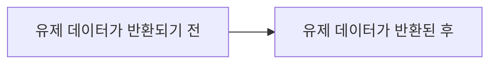

<!--more-->

<br/>

&nbsp;&nbsp; 이번 포스트에서는 request.user 데이터가 어떻게 생성되는지를 다루겠습니다. 부가적으로, "CSRF Failed: CSRF token missing or incorrect" 오류를 해결하는 방법도 다루겠습니다.

---

### (1) 세션 기반 인증

&nbsp;&nbsp; 장고의 인증 시스템은 세션 기반 인증 시스템을 디폴트로 합니다. 장고는 유저가 로그인하면 세션 ID를 포함한 세션 정보를 생성하고 DB에 저장합니다. 그리고 유저에게 이 세션 ID가 포함된 쿠키를 전달합니다. 유저는 웹 사이트에 접속할 때마다 다시 이 쿠키를 서버에 전달하고, 서버는 세션에 이 쿠키가 가진 값과 일치하는 데이터가 있는지를 확인하여 유저를 인증시킵니다. 그렇다면 유저로부터 이 쿠키가 전달되는 원리는 무엇일까요?

> HTTP는 stateless하다. 즉, 매 리퀘스트는 독립적으로 수행되고, 수행된 리퀘스트는 이전 리퀘스트의 정보를 알지 못한다. 이때 서로 다른 리퀘스트를 stateful하게 하는 수단 중 하나가 세션(Session)과 쿠키(Cookie)를 통한 통신 방법입니다.

> 세션(Session) : 세션은 여러 사용자들의 리퀘스트 정보를 저장하며, 서버 측 리소스를 사용한다. 세션은 사용자 별로 고유한 세션 ID를 포함한 세션 데이터를 생성하고 DB에 저장하며, 이 세션 ID를 쿠키(또는 URL)에 포함하여 사용자에게 전달한다.

> 쿠키(Cookie) : 쿠키는 서버가 클라이언트에게 전달하는 데이터 조각으로, 클라이언트 측 리소스를 사용한다. 이 데이터 조각에는 세션 ID가 포함되어 있으며, 사용자는 이 쿠키를 다시 서버에 전달하여 이전 리퀘스트의 정보를 사용할 수 있다.

&nbsp;&nbsp; 쿠키는 유저가 리퀘스트할 때마다 리퀘스트의 헤더 부분에 포함되어 전달됩니다. 서버는 이 헤더의 쿠키를 보고 유저 정보를 확인합니다. 한번 VSCode에서 <code>print(request.headers)</code>로 리퀘스트의 헤더 부분을 출력해보면, 출력값은 다음과 같습니다.

<br/>

<div align="center">

</div>

<br/>

&nbsp;&nbsp; <code>headers</code> 안에 <code>Cookie</code> 데이터가 포함되어 있음을 확인할 수 있습니다.

<br/>

### (2) request.user

&nbsp;&nbsp; 그렇다면 늘상 장고에서 당연하게 사용하고 있는 <code>request.user</code>는 어떻게 생성되는 것일까요? 일단 논리를 한 번 되짚어 봐야 합니다.

1. 유저가 <code>ID</code>와 <code>password</code>로 로그인하면, 장고은 자동으로 세션 정보를 DB에 저장하고, 유저에게 쿠키를 전달한다.

2. 유저가 리퀘스트하면, 헤더에 전달 받은 쿠키가 포함된다.

3. 장고는 이 쿠키를 가지고 DB상에 일치하는 유저 데이터를 반환한다.

4. <code>views.py</code>에서 <code>request.user</code>가 생성된다.

<br/>

&nbsp;&nbsp; 한 가지 이상한 점이 있습니다. 위의 3번 과정에서 <code>request</code>와 4번 과정에서 <code>request</code>는 과연 동일한 것일까요? 3번 과정을 자세히 보면 <code>request</code>는 다음 두 가지 상태를 거치게 됨을 알 수 있습니다.

<br/>



<br/>

&nbsp;&nbsp; 유저 데이터가 반환된 뒤에라야 비로소 우리는 <code>request.user</code>를 사용할 수 있음에 주목해야 합니다. 그렇다면 유저 데이터는 언제 반환되는 것일까요?

<br/>

### (3) return user

&nbsp;&nbsp; 장고는 자체적으로 세션 인증 시스템을 가지고 있지만, DRF를 설치하고 나면 DRF의 세션 인증 시스템이 디폴트로 설정됩니다. 이를 settings.py에서 명시적으로 표현하면 다음과 쓸 수 있습니다.

```python
REST_FRAMEWORK = {
    "DEFAULT_AUTHENTICATION_CLASSES": [
        "rest_framework.authentication.SessionAuthentication",
    ]
}
```

&nbsp;&nbsp; 표현 그대로 디폴트 인증 시스템으로 DRF의 세션 인증 시스템을 사용하겠다는 것입니다. 위의 코드가 우리가 인증 시스템과 관련하여 아무 설정도 하지 않았을 때의 디폴트 값입니다. 이제 저 <code>SessionAuthentication</code>이 어떻게 생겼는지 들여다보겠습니다.

<br/>

<div align="center">

</div>

<br/>

&nbsp;&nbsp; 너무 친절하게 잘 설명되어 있습니다. <code>SessionAuthentication</code>은 인증을 위해 장고의 세션 프레임워크를 사용합니다. 그리고 <code>authenticate</code> 메소드를 통해 현재 세션이 로그인 한 유저의 데이터를 가지고 있는지를 확인하고, 있다면 유저를, 없다면 <code>None</code>을 반환한다고 합니다.

&nbsp;&nbsp; 여기까지의 과정을 풀어서 설명하면, 유저가 서버에 리퀘스트를 보내면, 장고는 리퀘스트의 헤더에 세션 쿠기가 존재하는지를 확인합니다. 만약 세션 쿠키가 있다면, DB에서 연관된 세션 데이터가 있는지를 찾습니다. 연관된 세션 데이터를 발견하고, 해당 세션 데이터가 유효한 유저 데이터를 포함하고 있다면 그 유저 객체를 <code>request.user</code>에 할당하는 것입니다. 한편, 헤더에 세션 쿠키가 없거나, DB에 연관된 세션 데이터가 없다면 장고는 Anoymous 유저 객체를 할당합니다.

<br/>

### (4) 결론

&nbsp;&nbsp; 그래서 실제로는 유저가 리퀘스트 했을 시, 그 리퀘스트가 곧바로 <code>views.py</code>의 <code>request</code> 인자로 들어오는 것이 아닌, 일련의 과정을 거치면서 가공된 뒤에야 인자로 들어올 수 있는 것입니다. 달리 표현하면, "<code>views</code> 클래스보다 먼저 실행되는 클래스들이 있다!", "그중 하나가 <code>SessionAuthentication</code> 클래스이다!"라는 것입니다.

<br/>

### (5) +ɑ : CustomAuthentication

&nbsp;&nbsp; <code>request.user</code>가 생성되는 원리를 대강 알았으니, 약식으로 직접 구현해보겠습니다. 먼저, 사용자 정의 인증 클래스를 생성하기 위해서는 <code>BaseAuthentication</code>을 상속해야 합니다. 그리고 <code>authenticate</code> 메소드를 반드시 오버라이딩해야 한다고 합니다.

<br/>

<div align="center">

</div>

<br/>

&nbsp;&nbsp; 이를 바탕으로 <code>CustomAuthentication</code> 클래스를 구현하겠습니다. 우선, 정상적으로 리퀘스트가 이뤄지는만 확인합니다. 코드는 다음과 같습니다.

```python
class CustomAuthentication(BaseAuthentication):

    def authenticate(self, request):
        print(request.headers)

        return None
```

&nbsp;&nbsp; 이제 간단하게 포스트맨으로 <code>username</code>과 <code>password</code> 데이터가 담긴 JSON 데이터를 보내고 결과를 확인하겠습니다.

<br/>

<div align="center">

</div>

<br/>

&nbsp;&nbsp; 403 오류가 발생했습니다. 오류 내용을 읽어보면 CSRF 토큰이 없어서 발생한 오류임을 알 수 있습니다. 장고의 세션 인증 프레임워크에는 기본적으로 유저를 인증할 때 CSRF 공격을 방어하기 위한 메커니즘이 활성화되어 있습니다. 이 문제를 해결하는 방법은 다음의 두 가지가 있습니다.

1. 사용자 정의 인증 시스템을 구현하고 있으니, 기존의 세션 인증 시스템을 무력화한다.

2. CSRF 토큰을 획득한 뒤에, 로그인을 시도한다.

#### 1. 기존의 세션 인증 시스템을 무력화하기

&nbsp;&nbsp; 첫 번째 방법이 가장 쉽습니다. 현재 사용자 정의 인증 시스템을 구현하고 있기 때문에 <code>settings.py</code>로 가서 기존 세션 인증 시스템을 없애고, 사용자 정의 인증 시스템을 추가하면 됩니다.

```python
REST_FRAMEWORK = {
    "DEFAULT_AUTHENTICATION_CLASSES": [
        # "rest_framework.authentication.SessionAuthentication",
        "config.authentication.CustomAuthentication",
    ]
}
```

&nbsp;&nbsp; 장고는 <code>DEFAULT_AUTHENTICATION_CLASSES</code> 안에 등록된 인증 방법을 순서대로 시도합니다. 그런데 첫 번째(혹은 디폴트)가 장고의 세션 인증이므로, 로그인을 하게 되면 서버는 이 방법을 가장 먼저 사용합니다. 장고의 세션 인증은 로그인시에 CSRF 토큰을 필수로 요구합니다. 따라서, 이를 주석 처리하거나 코드를 삭제하여 서버가 장고의 세션 인증 방법을 시도하지 않게끔 하면 됩니다.

&nbsp;&nbsp; 물론 이렇게 하면 심각한 보안상의 구멍이 생깁니다만, 여기서는 단순히 장고의 유저 인증 과정을 살펴보는 것이 목표이므로, 사뿐히 즈려밟고갑니다. 저처럼 단순히 과정만을 살피고자 한다면 첫 번째 방법을 택할 것을 권합니다. 참고로 <code>"config.authentication.CustomAuthentication"</code>은 <code>CustomAuthentication</code>이 위치한 경로입니다.

#### 2. CSRF 토큰을 획득하고 로그인하기

&nbsp;&nbsp; 두 번째 방법은 장고의 세션 인증 시스템을 무력화하지 않는 대신 CSRF 토큰을 획득하여 정상적으로 로그인하는 방법입니다.

&nbsp;&nbsp; 두 번째 방법을 사용하기 위해서는 포스트맨의 자체 메소드를 사용해야 합니다. 메소드를 사용하는 방법에 대해서는 여타 블로그나 스택 오버플로우에서 쉽게 찾아볼 수 있습니다.

&nbsp;&nbsp; 우선, 포스트맨에서 Tests 부분에 아래와 같이 코드를 입력합니다.

<br/>

<div align="center">

</div>

<br/>

&nbsp;&nbsp; 사실 포스트맨의 메소드는 저도 공부해본 적이 없는지라 자세하게 설명할 수가 없습니다. 다만 메소드 이름에서 알 수 있듯이, 해당 메소드가 어떤 역할을 하는지만 대강 추론할 수 있습니다.

&nbsp;&nbsp; 우선, <code>getResponseCookie</code> 메소드로 해당 url에 접근하여 쿠키 데이터를 받고, 거기서 <code>csrftoken</code> 데이터만을 추출합니다. 그리고 <code>csrftoken</code>을 글로벌 변수로 선언하여 차후의 리퀘스트에서도 사용할 수 있게 합니다.

&nbsp;&nbsp; CSRF 토큰은 인증된 사용자가 아니더라도 받을 수 있기 때문에, 포스트맨이 테스트 스크립트를 실행하여 CSRF 토큰을 먼저 받아오고, 이를 글로벌 변수로 선언하여 다음 리퀘스트에서 사용하는 것입니다.

&nbsp;&nbsp; 이제 CSRF 토큰이 있으니, 이를 헤더에 담아 전송하면 됩니다. Key는 <code>X-CSRFToken</code>으로 하고, Value에 글로벌 변수로 선언한 <code>csrftoken</code> 값을 담아 전송합니다.

<br/>

<div align="center">

</div>

<br/>

&nbsp;&nbsp; <code>authenticate</code> 메소드가 잘 실행됐음을 알 수 있습니다.

&nbsp;&nbsp; 위의 과정에서 한 가지 알 수 있는 것은 **첫 리퀘스트는 반드시 실패한다**입니다. 무슨 소리냐 하면, 첫 리퀘스트 때에 테스트 스크립트로 CSRF 토큰을 획득한다는 것은 앞서 이야기한대로입니다. 그렇기에 첫 리퀘스트시에 헤더에는 CSRF 토큰이 존재하지 않기 때문에 반드시 실패한다는 것입니다. (참고로 포스트맨의 테스트 코드는 리퀘스트에 대한 리스폰스를 받은 뒤에 실행됩니다.) 여기서는 사용자 정의 인증 시스템을 구현하고 있으니, 첫 번째 방법으로 CSFR 토큰 오류를 해결하겠습니다.

&nbsp;&nbsp; 이제 CSRF 토큰 문제를 해결했으니, 계속 진행하겠습니다. <code>CustomAuthentication</code>을 마저 구현합니다.

```python
from django.shortcuts import get_object_or_404

from rest_framework.authentication import BaseAuthentication

from users.models import CustomUser


class CustomAuthentication(BaseAuthentication):
    def authenticate(self, request):
        username = request.headers.get("username")

        if not username:
            return None

        user = get_object_or_404(CustomUser, username=username)

        return (user, None)
```

&nbsp;&nbsp; 단 6줄의 코드로 사용자 인증 시스템을 구현(?)했습니다. 사이트를 방문할 때마다 장고는 <code>authenticate</code> 메소드를 실행할 것입니다. 원리는 간단합니다. 포스트맨에서 리퀘스트 할 때 헤더 부분에 <code>username</code>을 직접 추가합니다. 리퀘스트하면, DB는 해당 <code>username</code>과 일치하는 유저가 존재하는지 확인하고, 이를 반환합니다. 반환할 때는 반드시 튜플 형태로 반환해야만 합니다. 이하의 참고 사진에서 노란색으로 밑줄된 주석을 참고하세요.

<br/>

<div align="center">

</div>

<br/>

&nbsp;&nbsp; 포스트맨으로 다음과 같이 로그인한 유저 정보를 출력하는 API에 <code>GET</code> 메소드로 리퀘스트하고, 결과를 확인합니다. 해당 API에는 <code>permission_classes</code>로 <code>IsAuthenticated</code>가 있기 때문에 인증된 사용자만 리퀘스트할 수 있습니다.

<br/>

<div align="center">

</div>

<br/>

&nbsp;&nbsp; 인증되었음을 확인할 수 있습니다.
