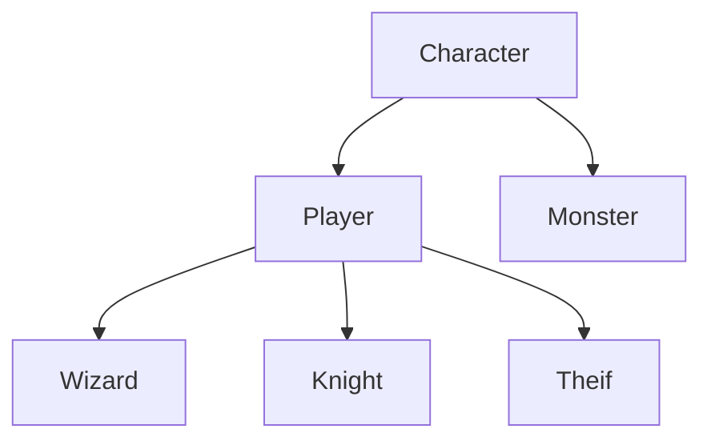

<!-- more -->

<br/>

&nbsp;&nbsp; 이번 포스트에서는 코드를 정리하고자 합니다. 이 포스트를 작성하는 시점에 과제는 이미 제출된 상태이고, 과제 해설 강의에서 코드 리뷰까지 받은 상태입니다. 다만, 아쉬움이 남아서 제 나름대로 정리할 수 있는 부분까지만이라도 정리해놓을까 합니다. 일단 크게 눈에 띈 것은 총 세 부분입니다.

1. 클래스의 깊이
2. 메소드 정의의 복잡함
3. 반복문의 깊이

&nbsp;&nbsp; 한 가지씩 순서대로 코드를 개선해보겠습니다.

---

### 1. 클래스의 깊이

<br/>



<br/>

&nbsp;&nbsp; 현재 구현된 게임의 클래스 깊이는 위와 같습니다. 게임을 실행하기 위해서는 플레이어 클래스의 하위 클래스 셋 중 하나와 몬스터 객체, 총 두 종류의 객체가 생성되어야 합니다. 플레이어 객체와 몬스터 객체는 이름이라든지, HP라든지 공통되는 내부 변수가 있고, 공격 메소드와 피격 메소드 등 공통되는 내부 메소드가 있습니다. 하지만 이 작은 게임에 이렇게까지 세 분화하여 클래스를 나눌 필요가 있을까 하는 생각이 듭니다. 클래스는 Entity라는 상위 클래스 하나에 플레이어 클래스와 몬스터 클래스라는 하위 클래스 두 개만을 두고자 합니다.

&nbsp;&nbsp; 플레이어에는 전사, 마법사, 도적 세 가지 직업이 있으므로, 각 직업의 특성을 나타내는 str, int, dex라든지, 레벨업을 위한 경험치 및 전투 보상으로 획득한 골드 데이터를 저장하기 위한 exp, gold가 필요합니다.

&nbsp;&nbsp; 몬스터는 직업을 가질 일도, 레벨업 할 일도, 보상을 얻을 일도 없으므로, 공격시에 어떻게 데미지 데이터를 생성할 것인지만 고민하면 됩니다. 생성된 몬스터의 특성을 살리는 측면에서 몬스터에게도 str, int, dex 특성을 부여하도록 하겠습니다. 이에 따라 플레이어 클래스와 몬스터 클래스의 틀이 될 Entity 클래스 설계는 다음처럼 됩니다.

<br/>

```python
import random

class Entity:
    def __init__(self, name:str, hp:int, mp:int, str_:int, int_:int, dex_:int) -> None:
        self._name = name
        self._hp = hp
        self._mp = mp
        self._str = str_
        self._int = int_
        self._dex = dex_

        # 각각 치명타율과 회피율 / 민첩성(dex)이 확률 상승에 크게 기여하도록 설정
        self._critical_rate = 10 + round((self._str + self._int*0.5 + self._dex*3)/5)
        self._evasion_rate = 5 + round((self._str * 0.5 + self._dex*3) / 5)

        # 공격 데이터를 반환하는 공격 메소드
    def attack(self) -> list:
        # attack_info = [is_area_attack, damage]를 반환
        return []

        # 공격 데이터를 인자로 받는 피격 메소드
    def attacked(self, attack_info: list) -> None:
        # 체력 잔여량을 보여주는 내부 함수
        def show_hp() -> None:
            print(f"{self._name}의 남은 체력 : {self._hp} ")

        p = random.random()
        if p < self._evasion_rate:
            print(f"{self._name}이(가) 공격을 회피했습니다.")
            show_hp()
        else:
            print(f"{self._name}이(가) {attack_info[1]}의 피해를 입었습니다.")
            show_hp()
```

<br/>

### 2. 메소드 정의의

&nbsp;&nbsp; 현재 번잡하게 작성된 메소드 코드들도 정리하겠습니다. 원래 코드에는 레벨업을 할 때나 전투시 현재 체력을 보여줘야 할 때 등 객체의 데이터를 반환하거나, 변경할 일이 있을 때를 대비하여 일일이 메소드를 정의했습니다. 여기서는 setattr과 getattr 함수를 사용하여 각각 한 메소드에서 데이터 반환, 또는 변경을 할 수 있도록 하겠습니다. 코드는 다음과 같습니다.

<br/>

```python
class Entity:
    # ... codes

        # 내부 변수의 값을 변경하는 메소드
    def change_status(self, **kwargs):
        for key, value in kwargs.items():
            setattr(self, f"_{key}", value)

        # 내부 변수의 값을 반환하는 메소드
    def get_status(self, *args) -> dict:
        attr_dict = {attr: getattr(self, f"_{attr}") for attr in args}
        return attr_dict
```

<br/>

### 3. 반복문의 깊이

&nbsp;&nbsp;
&nbsp;&nbsp;
&nbsp;&nbsp;
&nbsp;&nbsp;
&nbsp;&nbsp;
&nbsp;&nbsp;
&nbsp;&nbsp;
&nbsp;&nbsp;
&nbsp;&nbsp;
&nbsp;&nbsp;
&nbsp;&nbsp;
&nbsp;&nbsp;
&nbsp;&nbsp;
&nbsp;&nbsp;
&nbsp;&nbsp;
&nbsp;&nbsp;
&nbsp;&nbsp;
&nbsp;&nbsp;
&nbsp;&nbsp;
&nbsp;&nbsp;
